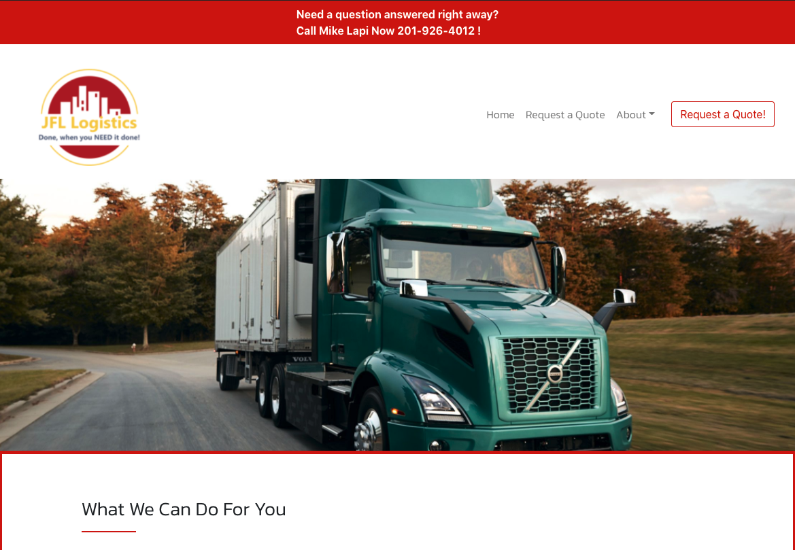

# JFL_Logistics

JFL Logistics is a trucking and warehouse company based in Paterson New Jersey.  
This website was built to provide a homepage with contact capabailites to the president and CEO of JFL Logistics to increase business.  

The applicaiton is built with React to take advantage of the Single Page Application feature React provides.  Some other technologies used are Bootstrap for styling, EmailJS to handle realtime email inquiries ReactRouterDOM to handle routing and React Toast notifications for successful and unsuccessful contact attempts. 

This website was built by David Johnson.  Any questions, inquiries or bug reporting please contact me at <a href="mailto:johnsondavid1107@gmail.com"> johnsondavid1107@gmail.com</a>

